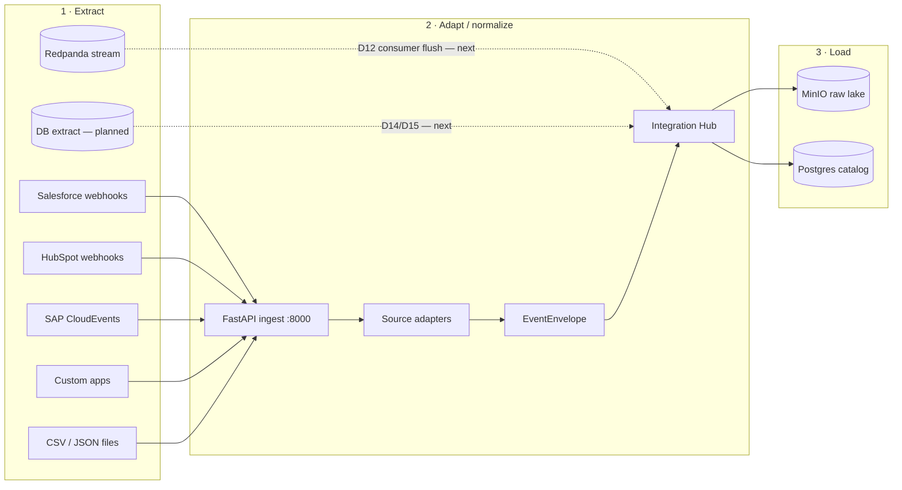
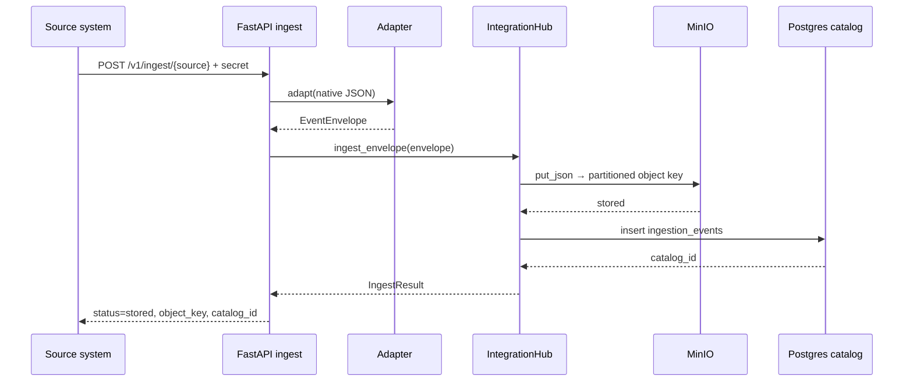
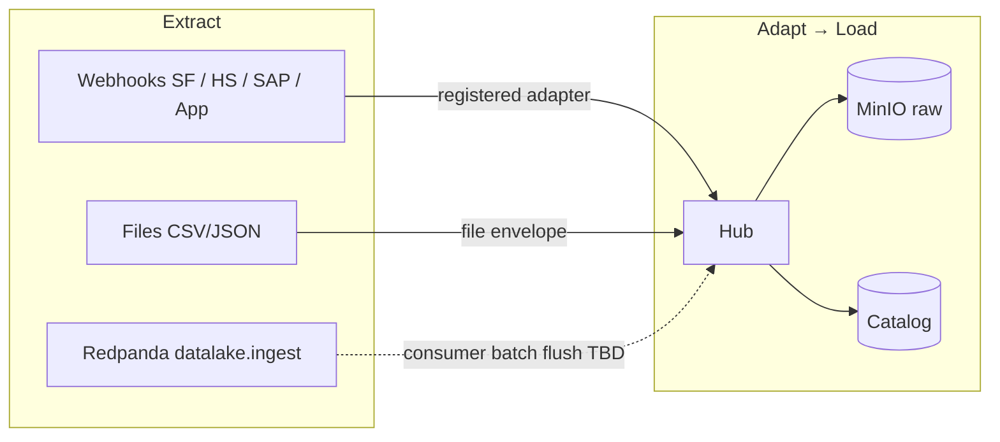
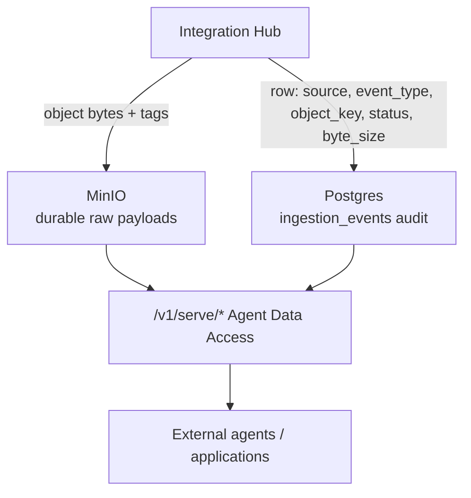

# Data pipeline flow — Extraction → Loading (MinIO)

**System:** DataLakeSkM foundation  
**Boundary:** Sources → System Integration Hub → Raw MinIO + Postgres catalog  
**Not in this diagram:** NEO agent / semantic layer (consumes the lake later)

---

## 1. End-to-end (ELT-style)

Today the foundation is closer to **EL** (extract → load raw) with a thin **adapt/normalize** step in the hub. Transform-to-silver/gold is later.



---

## 2. Detailed flow (current working path)

```mermaid
flowchart TB
  subgraph Sources
    S1[CRM / ERP / App JSON]
    S2[Flat file upload or drop folder]
  end

  subgraph Ingestion["Ingestion API"]
    AUTH[X-Webhook-Secret]
    R1["POST /v1/ingest/{source}"]
    R2["POST /v1/files/upload"]
    R3["POST /v1/files/process-incoming"]
  end

  subgraph Hub["connectors.hub.IntegrationHub"]
    REG[SourceRegistry]
    A_SF[SalesforceAdapter]
    A_HS[HubSpotAdapter]
    A_SAP[SAPAdapter]
    A_G[GenericAdapter]
    A_F[File → EventEnvelope]
    ENV2[EventEnvelope<br/>source · event_type · object_id · payload · tags]
  end

  subgraph Storage["storage.ObjectStorage"]
    PART[Partition key builder]
    PUT[put_json / put_bytes]
    TAGS[Object tags + metadata]
  end

  subgraph Lake["Load targets"]
    M[(MinIO bucket datalake-raw)]
    P[(Postgres ingestion_events)]
  end

  S1 --> AUTH --> R1
  S2 --> AUTH --> R2
  S2 --> R3

  R1 --> REG
  REG --> A_SF & A_HS & A_SAP & A_G
  A_SF & A_HS & A_SAP & A_G --> ENV2
  R2 & R3 --> A_F --> ENV2

  ENV2 --> PART --> PUT --> TAGS --> M
  ENV2 --> P
```



---

## 3. Stage map (extraction → MinIO)

| Stage | What happens | Where in code / stack |
|-------|----------------|------------------------|
| **Extract** | Pull or receive native payloads from systems of record | Webhooks to FastAPI; files via upload/drop; Kafka topic `datalake.ingest` (produce smoke today) |
| **Adapt** | Map native shape → `EventEnvelope` | `connectors/adapters/*`, `connectors/file_ingest.py` |
| **Route** | Hub chooses storage + catalog write | `connectors/hub.py` |
| **Partition** | Build Hive-style key | `storage/partitioning.py` |
| **Load (objects)** | Write bytes/JSON to MinIO | `storage/client.py` → MinIO `:9006` |
| **Load (audit)** | Insert catalog row | `catalog/client.py` → Postgres `:5433` |

---

## 4. Object key layout (after load)

```text
s3://datalake-raw/
  raw/
    source=<salesforce|hubspot|sap|app|file|…>/
      year=YYYY/
        month=MM/
          day=DD/
            <event_type>_<object_id>.json
```

Example:

```text
raw/source=sap/year=2026/month=09/day=25/businesspartner.changed_1000123.json
```

Tags (typical): `source`, `event_type`, plus envelope tags — for later NEO / access rules.

---

## 5. Sequence (one webhook event)



---

## 6. Paths by source type



| Extract style | Entry | Status |
|---------------|-------|--------|
| Event-driven webhook | `/v1/ingest/{source}` | **Live** |
| File (push) | `/v1/files/upload` | **Live** |
| File (drop) | `data/incoming/` + process-incoming | **Live** |
| Stream | produce to `datalake.ingest` | Smoke **live**; consumer→MinIO **next** |
| DB batch | Postgres/MySQL extract job | **Planned** (D14/D15) |

---

## 7. What loads where — and what serves out



| Direction | API | Status |
|-----------|-----|--------|
| **In** | `/v1/ingest/{source}`, `/v1/files/*` | Live |
| **Out (serve)** | `/v1/serve/events`, `/v1/serve/events/{id}`, `/v1/serve/objects`, `/v1/serve/objects/presign` | **Live (MVP)** |
| Auth (serve) | `X-Agent-Key` or `X-Webhook-Secret` | Live |

Demo: `./scripts/demo_serve.sh`

- **MinIO** = system of record for **payloads**.  
- **Postgres catalog** = index for **discovery**.  
- **`/v1/serve`** = first Agent Data Access Layer (fetch + optional presign). Full NEO authZ/semantics still later.

---

*See also: `docs/FOUNDATION_ALIGNMENT.md`, `docs/architecture.html`, `docs/DEMO_RUNBOOK.md`.*
